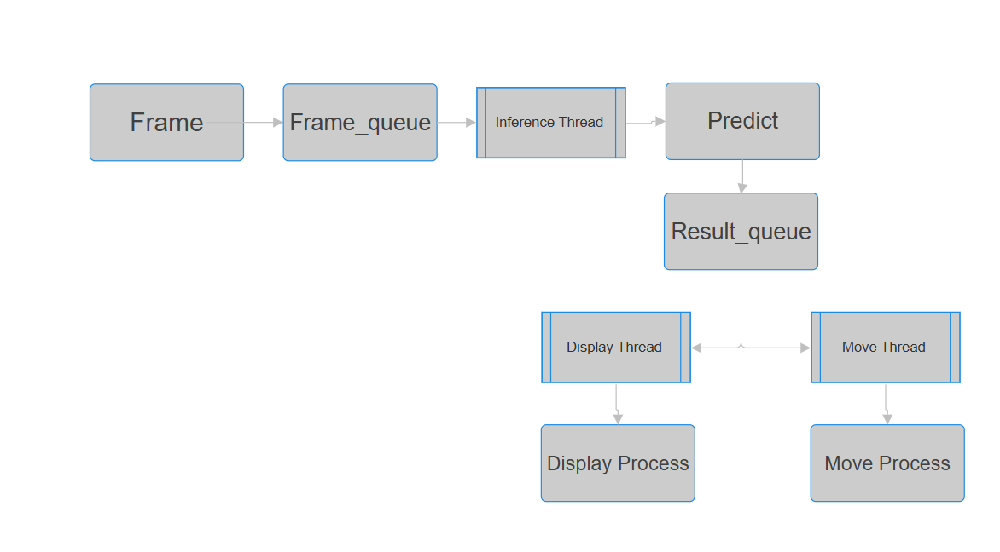

## 🧠 CARLA YOLO Multi-Threaded System

Bu proje, **CARLA simülasyon ortamında YOLO modelleri** kullanarak **gerçek zamanlı çok iş parçacıklı (multi-threaded)** bir sistem oluşturur.
Sistem, üç ana bileşenden oluşur:

* 🧩 **Inference Thread:** Kameradan alınan frameleri modellerle işler.
* 🎥 **Display Thread:** FPS değeriyle birlikte sonuçları gösterir.
* 🚗 **Move Thread:** Tahmin sonuçlarına göre aracın kontrolünü sağlar.

---

### 🖼️ Sistem Akış Şeması



> Diyagram, frame’lerin `Queue` ve `Deque` yapıları üzerinden thread’ler arasında nasıl paylaşıldığını gösterir.

---

### ⚙️ Kurulum

```bash
pip install carla opencv-python numpy ultralytics
```

---

### ▶️ Simülasyonu Başlatma

CARLA simülasyonunu başlatmak için:

```bash
CarlaUE4.exe -ResX=10 -ResY=10 -quality-level=low -windowed
```

---

### 🚀 Ana Kod

```python
import carla
import random
import time
import numpy as np
import cv2
from threading import Thread, Lock, Event
from collections import deque
from queue import Queue
from Model_Yolo import model_yolo
from Setup import CarlaSetup

IM_HEIGHT = 480
IM_WIDTH = 640

# Simülasyon'u cmd'de çalıştırma komutu 
# CarlaUnreal.exe -ResX=10 -ResY=10 quality-level=low -windowed

frame_queue = Queue(maxsize=10)
results_queue = deque(maxlen=3)
stop_event = Event()

def process_img(frame):
    array = np.frombuffer(frame.raw_data, dtype=np.uint8)
    array = array.reshape((IM_HEIGHT, IM_WIDTH, 4))
    img = array[:, :, :3]
    try:
        frame_queue.put_nowait(img.copy())
    except:
        pass
...
# (kodun geri kalanı main.py içinde)
```

> 📌 Kodun tamamı için `main.py` dosyasına göz atın.

---

### 🧩 Yapı Özeti

| Yapı            | Tip     | Açıklama                                         |
| --------------- | ------- | ------------------------------------------------ |
| `frame_queue`   | `Queue` | Kameradan gelen frameler burada saklanır         |
| `results_queue` | `deque` | Model tahmin sonuçları burada tutulur            |
| `stop_event`    | `Event` | Thread’leri durdurmak için senkronizasyon objesi |

---

### 📊 FPS ve Thread Yönetimi

* `inference_loop()` fonksiyonu tahmin süresini ölçer.
* `display_loop()` FPS hesaplar ve ekranda gösterir.
* `move_car()` araç kontrolünü yönetir.
* Çıkışta `stop_event` tüm thread’leri güvenli şekilde durdurur.

---


### 🧹 Temizlik ve Kapanış

```python
for actor in carlaSet.actor_list:
    actor.destroy()
cv2.destroyAllWindows()
```

---

### 📄 Lisans

Bu proje yalnızca **araştırma ve eğitim** amaçlıdır.

---


